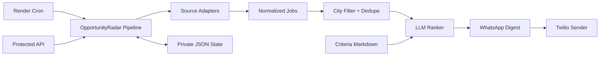

# OpportunityRadar

OpportunityRadar sends a weekly WhatsApp digest of high-signal jobs for Schwarzman Scholars. It focuses on roles in Beijing, Dubai, Shenzhen, New York, and San Francisco, then uses a human-editable criteria file plus an LLM ranker to decide which roles are actually worth sending.

The project is intentionally built around adapters and durable state so one broken career page does not break the whole weekly digest.

## What It Does

- Pulls jobs from structured ATS/feed sources first: Greenhouse, Lever, Ashby, RSS, and a configurable HTML fallback.
- Normalizes target-city aliases including NYC, New York City, SF, Shenzhen, and Shenzen.
- Dedupe jobs across sources and suppresses jobs already sent in previous weeks.
- Uses `docs/opportunity-criteria.md` to guide LLM judgment for what counts as a cool Scholar-relevant role.
- Sends a WhatsApp-safe weekly digest through Twilio.
- Supports approved Twilio WhatsApp templates for proactive notifications.
- Exposes protected preview and run endpoints for manual checks.
- Stores durable state in local JSON for development or a private GitHub repo in production.

## Architecture



## Local Development

Install dependencies:

```powershell
python -m pip install -r requirements-backend.txt
```

Run a fixture-backed dry run without spending model tokens:

```powershell
python scripts\run_weekly_digest.py --root . --sources tests\fixtures\sources.fixture.json --deterministic-fallback --include-seen
```

Run with real configured sources and OpenRouter ranking:

```powershell
python scripts\run_weekly_digest.py --root . --dry-run
```

Send to configured recipients:

```powershell
python scripts\run_weekly_digest.py --root . --send
```

Run the protected API locally:

```powershell
python scripts\serve_backend.py --root . --host 127.0.0.1 --port 8765
```

Preview through HTTP:

```powershell
Invoke-RestMethod -Method Post -Uri http://127.0.0.1:8765/digest/preview -Headers @{ Authorization = "Bearer $env:OPPORTUNITY_API_TOKEN" } -Body '{}' -ContentType 'application/json'
```

## Configuration

Copy `data/config/sources.example.json` to `data/config/sources.local.json` for local private source config. Production can read `sources.json` from a private GitHub repo using `GITHUB_SOURCES_PATH`.

Important env vars:

```text
OPPORTUNITY_API_TOKEN=<optional bearer token for API endpoints>
OPPORTUNITY_RECIPIENTS=whatsapp:+15551234567,whatsapp:+15557654321
OPPORTUNITY_TIMEZONE=America/Edmonton
OPPORTUNITY_SEND_DOW=MON
OPPORTUNITY_SEND_HOUR=9
OPPORTUNITY_MAX_JOBS=10
OPENROUTER_API_KEY=<key>
OPENROUTER_RANK_MODEL=openai/gpt-4.1-mini
TWILIO_ACCOUNT_SID=<sid>
TWILIO_AUTH_TOKEN=<token>
TWILIO_WHATSAPP_FROM=whatsapp:+15551234567
TWILIO_WHATSAPP_CONTENT_SID=<optional approved template sid>
GITHUB_STATE_REPO=<owner/private-state-repo>
GITHUB_STATE_TOKEN=<fine-grained contents read/write token>
GITHUB_STATE_PATH=opportunity-state.json
GITHUB_SOURCES_PATH=sources.json
```

## Production Gate

```powershell
python scripts\run_production_gate.py --root .
```

The gate compiles Python, runs the unit/integration tests, and performs a fixture-backed digest smoke test.

## Deployment

`render.yaml` defines a web service and a cron service. The cron service runs hourly on Mondays in UTC and passes `--respect-schedule`; the app only sends during the configured local send hour, avoiding daylight-saving drift.

See `docs/private-state-repo-readme.md` for the private state/config repo layout.
