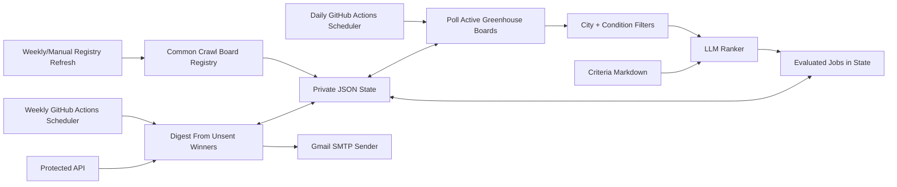

# OpportunityRadar

OpportunityRadar finds high-signal early-career opportunities for Schwarzman Scholars, ranks them against a human-editable criteria file, and sends a weekly email digest to a Google Group through Gmail SMTP.

The production model is intentionally narrow: GitHub Actions runs discovery and digest jobs, a private state repo stores durable JSON state, Gmail sends one message, and Google Groups manages the audience.

## What It Does

- Discovers public Greenhouse boards from Common Crawl and stores reusable board tokens in state.
- Polls active ATS boards daily, normalizes target-city postings, and filters out noisy roles before ranking.
- Uses `docs/opportunity-criteria.md` plus an LLM ranker to decide which roles belong in the digest.
- Stores evaluated jobs in durable JSON state so the weekly digest can send only unsent included opportunities.
- Sends one weekly plain-text email through Gmail SMTP to a configured Google Group.
- Leaves subscriber management, additions, removals, and delivery permissions to Google Groups.
- Provides local scripts, fixture-backed smoke runs, and protected API endpoints for manual checks.

## How It Runs

The app has three scheduled jobs in `.github/workflows/opportunity-radar-schedule.yml`:

| Job | Purpose | Sends email |
| --- | --- | --- |
| Registry refresh | Finds and stores public ATS board tokens. | No |
| Daily discovery | Polls boards, filters/ranks jobs, and writes evaluated state. | No |
| Weekly digest | Reads unsent included jobs from state and emails the Google Group. | Yes, when configured |

Manual workflow tasks behave differently:

| Task | What it does |
| --- | --- |
| `all-preview` | Runs registry, discovery, and a digest preview. It never sends email. |
| `registry` | Runs only the registry refresh. |
| `discovery` | Runs only daily discovery. |
| `weekly-preview` | Builds the weekly digest from state without sending. |
| `weekly-send` | Checks Gmail SMTP readiness, then sends the digest from state. |

A scheduled weekly run sends only when `OPPORTUNITY_SCHEDULER_ENABLED=true` and the runtime schedule guard matches `OPPORTUNITY_TIMEZONE`, `OPPORTUNITY_SEND_DOW`, and `OPPORTUNITY_SEND_HOUR`. Manual `weekly-send` is for test sends and operational retries.

## Architecture



## Gmail And Google Groups Setup

Production delivery assumes:

- A Google Group exists for recipients, for example `schwarzman-job-updates@googlegroups.com`.
- The Gmail account used as sender has SMTP access and an app password.
- The Google Group allows the sender address to post to the group.
- GitHub Actions has the repo secrets and variables below.

Use GitHub repository secrets for sensitive values:

```text
OPPORTUNITY_STATE_REPO=<owner/private-state-repo>
OPPORTUNITY_STATE_TOKEN=<fine-grained contents read/write token>
OPPORTUNITY_RECIPIENTS=schwarzman-job-updates@googlegroups.com
OPENROUTER_API_KEY=<capped OpenRouter key>
SMTP_USERNAME=schwarzmanjobupdates@gmail.com
SMTP_APP_PASSWORD=<Gmail app password>
```

Use GitHub repository variables for non-secret settings:

```text
OPPORTUNITY_SCHEDULER_ENABLED=true
OPPORTUNITY_TIMEZONE=Asia/Shanghai
OPPORTUNITY_SEND_DOW=WED
OPPORTUNITY_SEND_HOUR=9
OPPORTUNITY_SEND_PROVIDER=gmail_smtp
OPPORTUNITY_EMAIL_SUBJECT=Weekly Job Newsletter
OPPORTUNITY_MAX_JOBS=30
OPPORTUNITY_MIN_JOBS=15
OPPORTUNITY_MAX_JOBS_PER_COMPANY=2
SMTP_HOST=smtp.gmail.com
SMTP_PORT=587
SMTP_FROM=Schwarzman Job Updates <schwarzmanjobupdates@gmail.com>
SMTP_USE_STARTTLS=true
```

For Wednesday 09:00 Beijing time, keep the GitHub Actions weekly cron aligned with the runtime guard:

```yaml
- cron: "0 1 * * WED" # 09:00 Asia/Shanghai
```

The `Check send readiness` and `Run weekly digest` schedule checks in the workflow should compare `github.event.schedule` to that same cron string.

## Manual Sends

Use manual sends for smoke tests and one-off retries:

1. Open **Actions** -> **OpportunityRadar schedule** -> **Run workflow**.
2. Choose `weekly-send`, not `all-preview`.
3. Confirm the run includes the `Check send readiness` step.
4. Confirm Gmail accepted the SMTP send and the Google Group delivered it to members.

`all-preview` and `weekly-preview` are deliberately safe: they build previews but never email the group.

## State And Config Files

Local development reads from files under `data/` by default. Production can read runtime files from a private GitHub state repo.

| File | Purpose |
| --- | --- |
| `data/config/discovery.example.json` | Common Crawl registry and board-polling limits. |
| `data/config/conditions.example.json` | Posting recency, target locations, role groups, exclude terms, and years-of-experience filters. |
| `data/config/sources.example.json` | Optional explicitly configured sources. |
| `docs/opportunity-criteria.md` | Ranking criteria used by the LLM. |
| `data/state/opportunity-state.json` | Local durable state for development runs. |

Production state repo variables can point to private equivalents with `GITHUB_DISCOVERY_PATH`, `GITHUB_CONDITIONS_PATH`, `GITHUB_SOURCES_PATH`, and `GITHUB_STATE_PATH`.

## Local Development

Install dependencies:

```powershell
python -m pip install -r requirements-backend.txt
```

Run fixture-backed discovery without writing state:

```powershell
python scripts\run_discovery.py --root . --sources tests\fixtures\sources.fixture.json --conditions tests\fixtures\conditions.fixture.json --deterministic-fallback --json
```

Preview a fixture-backed weekly digest without spending model tokens:

```powershell
python scripts\run_weekly_digest.py --root . --sources tests\fixtures\sources.fixture.json --deterministic-fallback --include-seen
```

Write evaluated jobs to local state, then preview the digest from state:

```powershell
python scripts\run_discovery.py --root . --sources data\config\sources.greenhouse-smoke.json --conditions data\config\conditions.example.json --deterministic-fallback --write
python scripts\run_weekly_digest.py --root . --from-state
```

Check Gmail SMTP readiness and send from evaluated state:

```powershell
python scripts\check_send_ready.py --root .
python scripts\run_weekly_digest.py --root . --send --from-state
```

Run the protected API locally:

```powershell
python scripts\serve_backend.py --root . --host 127.0.0.1 --port 8765
```

Preview through HTTP:

```powershell
Invoke-RestMethod -Method Post -Uri http://127.0.0.1:8765/digest/preview -Headers @{ Authorization = "Bearer $env:OPPORTUNITY_API_TOKEN" } -Body '{"from_state":true}' -ContentType 'application/json'
```

## Other Delivery Paths

The codebase still contains sender implementations for Gmail API, Microsoft Graph email, and Twilio WhatsApp. They are useful if the delivery model changes later, but this repository is currently documented around Gmail SMTP plus Google Groups because that is the intended production setup.

## Verification

Run the production gate before changing scheduling, delivery, or ranking behavior:

```powershell
python scripts\run_production_gate.py --root .
```

The gate compiles Python, runs unit/integration tests, performs fixture-backed registry refresh, exercises dynamic discovery, and runs digest smoke checks.

## Deployment Notes

`render.yaml` defines only the optional free Render web service. It does not create Render cron services because those can require paid cron billing.

Scheduled work is owned by GitHub Actions. Before enabling live sends, run `weekly-send` manually with a test recipient and confirm the Gmail-to-Google-Groups path is ready.

See `docs/cost-controls.md` for budget controls and `docs/private-state-repo-readme.md` for the private state repo layout.
