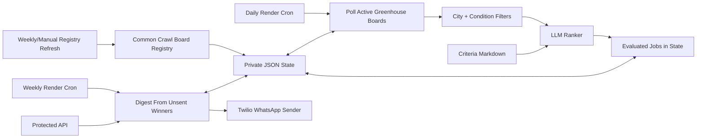

# OpportunityRadar

OpportunityRadar sends a weekly WhatsApp digest of high-signal jobs for Schwarzman Scholars. It focuses on roles in Beijing, Dubai, Shenzhen, New York, San Francisco, and Sydney, then uses a human-editable criteria file plus an LLM ranker to decide which roles are actually worth sending.

The project is intentionally built around adapters and durable state so one broken career page does not break the whole weekly digest.

## What It Does

- Discovers public Greenhouse boards from the free Common Crawl URL index, stores board tokens in durable state, then polls structured ATS APIs.
- For Greenhouse, polls discovered board indexes, keeps recent target-city postings, condition-filters lightweight rows, then detail-fetches only promising roles.
- Normalizes target-city aliases including NYC, New York City, SF, Shenzhen, Shenzen, and Sydney.
- Applies deterministic condition filters before the LLM, including posting recency, target locations, role groups, exclude terms, and the 0-5 years-of-experience requirement.
- Stores daily evaluated opportunities in durable JSON state, then sends the weekly digest from unsent included jobs.
- Uses `docs/opportunity-criteria.md` to guide LLM judgment for what counts as a cool Scholar-relevant role.
- Sends a WhatsApp-safe weekly digest through Twilio.
- Supports approved Twilio WhatsApp templates for proactive notifications.
- Exposes protected preview and run endpoints for manual checks.
- Stores durable state in local JSON for development or a private GitHub repo in production.

## Architecture



## Local Development

Install dependencies:

```powershell
python -m pip install -r requirements-backend.txt
```

Run a fixture-backed weekly dry run without spending model tokens:

```powershell
python scripts\run_weekly_digest.py --root . --sources tests\fixtures\sources.fixture.json --deterministic-fallback --include-seen
```

Refresh the public ATS board registry from a fixture-backed Common Crawl response:

```powershell
python scripts\refresh_registry.py --root . --discovery-config tests\fixtures\discovery.fixture.json --json
```

Run daily discovery against fixtures using fixture conditions:

```powershell
python scripts\run_discovery.py --root . --sources tests\fixtures\sources.fixture.json --conditions tests\fixtures\conditions.fixture.json --deterministic-fallback --json
```

Try the Greenhouse discovery flow against Anthropic without writing state:

```powershell
python scripts\run_discovery.py --root . --sources data\config\sources.greenhouse-smoke.json --conditions data\config\conditions.example.json --deterministic-fallback --json
```

Write evaluated jobs to local state, then preview the weekly digest from that state:

```powershell
python scripts\run_discovery.py --root . --sources data\config\sources.greenhouse-smoke.json --conditions data\config\conditions.example.json --deterministic-fallback --write
python scripts\run_weekly_digest.py --root . --from-state
```

Run with real configured sources and OpenRouter ranking using the legacy live weekly path:

```powershell
python scripts\run_weekly_digest.py --root . --dry-run
```

Send to configured recipients from evaluated state:

```powershell
python scripts\run_weekly_digest.py --root . --send --from-state
```

Run the protected API locally:

```powershell
python scripts\serve_backend.py --root . --host 127.0.0.1 --port 8765
```

Preview through HTTP:

```powershell
Invoke-RestMethod -Method Post -Uri http://127.0.0.1:8765/digest/preview -Headers @{ Authorization = "Bearer $env:OPPORTUNITY_API_TOKEN" } -Body '{"from_state":true}' -ContentType 'application/json'
```

## Configuration

Copy `data/config/discovery.example.json` to `data/config/discovery.local.json` to tune Common Crawl registry refresh and board-polling limits. Copy `data/config/conditions.example.json` to `data/config/conditions.local.json` to tune posting recency, target locations, role groups, exclude terms, and years-of-experience rules. `sources.local.json` remains optional for deliberately configured company boards or fixture-style sources. Production can read `discovery.json`, `conditions.json`, and optional `sources.json` from a private GitHub repo using `GITHUB_DISCOVERY_PATH`, `GITHUB_CONDITIONS_PATH`, and `GITHUB_SOURCES_PATH`.

Important env vars:

```text
OPPORTUNITY_API_TOKEN=<optional bearer token for API endpoints>
OPPORTUNITY_RECIPIENTS=whatsapp:+15551234567,whatsapp:+15557654321
OPPORTUNITY_TIMEZONE=America/Edmonton
OPPORTUNITY_SEND_DOW=MON
OPPORTUNITY_SEND_HOUR=9
OPPORTUNITY_MAX_JOBS=10
OPPORTUNITY_CITIES=Beijing,Dubai,Shenzhen,New York,San Francisco,Sydney
OPENROUTER_API_KEY=<key>
OPENROUTER_RANK_MODEL=openai/gpt-4.1-mini
TWILIO_ACCOUNT_SID=<sid>
TWILIO_AUTH_TOKEN=<token>
TWILIO_WHATSAPP_FROM=whatsapp:+15551234567
TWILIO_WHATSAPP_CONTENT_SID=<optional approved template sid>
GITHUB_STATE_REPO=<owner/private-state-repo>
GITHUB_STATE_TOKEN=<fine-grained contents read/write token>
GITHUB_STATE_PATH=opportunity-state.json
GITHUB_DISCOVERY_PATH=discovery.json
GITHUB_SOURCES_PATH=<optional sources.json>
GITHUB_CONDITIONS_PATH=conditions.json
```

## Production Gate

```powershell
python scripts\run_production_gate.py --root .
```

The gate compiles Python, runs the unit/integration tests, performs fixture-backed registry refresh and dynamic discovery smokes, then performs configured-source discovery and digest smokes.

## Deployment

`render.yaml` defines a web service plus three cron services:

- `opportunity-radar-registry-refresh` runs weekly and refreshes discovered Greenhouse board tokens from Common Crawl.
- `opportunity-radar-discovery` runs daily, polls active registry boards plus any optional configured sources, and writes evaluated jobs to durable state.
- `opportunity-radar-weekly` runs hourly on Mondays in UTC with `--respect-schedule --from-state`; the app only sends during the configured local send hour, avoiding daylight-saving drift.

See `docs/private-state-repo-readme.md` for the private state/config repo layout.
