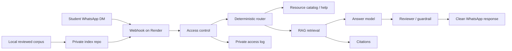

# Schwarzman Q&A

Schwarzman Q&A is a small retrieval-augmented WhatsApp assistant for answering
student questions from reviewed Schwarzman/Tsinghua resources. It is designed
for a limited student group, not as a public general-purpose chatbot.

The public repo contains the application code, crawler tooling, eval harness,
and deployment configuration. It intentionally does not contain the reviewed
student-resource corpus, raw downloaded files, extracted text, WhatsApp user
lists, or production secrets.

## What It Does

- Inventories authenticated Blackboard/Rencai resource pages through a local
  Chrome extension.
- Builds a reviewed local corpus from Blackboard files, Rencai files, and video
  transcripts.
- Converts approved files into searchable chunks with source metadata.
- Answers scoped Schwarzman/Tsinghua questions with citations.
- Supports resource-catalog questions such as “what can this tool answer?” and
  “what videos do we have?”
- Handles follow-up questions with short per-user conversation memory.
- Logs access, feedback, failed questions, answered questions, latency, and
  retrieval sources for operational review.
- Exposes a hosted HTTP backend and WhatsApp webhook for Twilio or Meta
  WhatsApp.

## Architecture



The app uses a deterministic router before the LLM. Simple bot/admin commands,
resource catalog questions, safety refusals, and obvious out-of-scope prompts
are handled without asking the model to guess. In-scope student questions go
through retrieval, answer drafting, review/guardrails, and final formatting.

## Repository Layout

```text
src/schwarzman_qa/       backend, retrieval, agents, policy, WhatsApp access
scripts/                 corpus build, eval, upload, backend, admin CLIs
docs/                    policy and design notes
data/evals/              sanitized eval cases
data/blackboard/         local-only source files, ignored by git
data/rencai/raw/         local-only source files, ignored by git
data/transcripts/raw/    local-only transcript files, ignored by git
data/corpus/             generated local corpus artifacts, ignored by git
deploy/                  deployment helpers; generated index is ignored
```

## Safety Model

- The corpus is reviewed before indexing.
- Answers must use retrieved source material and source-relative citations.
- The bot should say it does not know when the available materials do not answer
  the question.
- Prompt-injection attempts are classified before retrieval and reviewed before
  output.
- User-provided text and retrieved document text are treated as untrusted data.
- WhatsApp access is limited by password enrollment, allow/block controls, and
  optional admin-only commands.

## Local Development

Install backend dependencies:

```powershell
python -m pip install -r requirements.txt
```

Build a local index after adding reviewed local resources:

```powershell
python scripts\ingest_corpus_updates.py --root . --build-index
```

Run the backend locally:

```powershell
python scripts\serve_backend.py --root . --host 127.0.0.1 --port 8765
```

Ask through the local backend:

```powershell
python scripts\query_backend.py --url http://127.0.0.1:8765/ask "What documents do I need for the X1 visa?"
```

## Production Readiness

Before deploying code or an updated index, run:

```powershell
python scripts\run_production_gate.py --root .
```

The gate compiles Python files, audits corpus health, runs retrieval evals, runs
WhatsApp-style behavior smoke tests, and runs multi-turn conversation tests. It
writes a timestamped report under `data/evals/runs/`.

For fast iteration:

```powershell
python scripts\run_production_gate.py --root . --quick
```

## Deployment

The hosted service is a Render web service. The reviewed index is stored
separately in a private repo so the public app repo can remain code-only.

At runtime, the service loads:

- OpenRouter model credentials from environment variables.
- A private retrieval index from the private index repo.
- Optional WhatsApp access state from the same private repo.

The private index repo README contains the operator commands for corpus updates,
index upload, Render env vars, and WhatsApp admin commands.

## Documentation

- [Answering policy](docs/answering-policy.md)
- [WhatsApp Q&A design](docs/whatsapp-qa-agent-design.md)
- [Backend and WhatsApp setup notes](docs/backend-and-whatsapp.md)
- [Private index repo README template](docs/private-index-repo-readme.md)

## Important Note

This project is meant to help students navigate already-available program
resources. It is not a substitute for official Schwarzman Scholars, Tsinghua,
immigration, housing, medical, or legal guidance.
